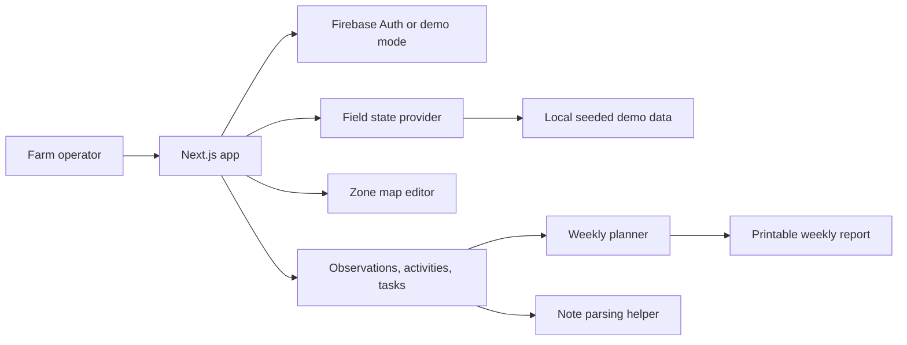

# khet

khet is a farm operations planner for small growers. It helps a farmer map field zones, log observations and completed work, turn rough notes into structured records, and generate a weekly plan based on what is actually happening on the ground.

This is not a general-purpose chatbot dressed up as farm software. The AI is limited to specific operational jobs: parsing field notes, spotting missing details, and helping turn recent activity into a usable plan for the week.

## Why this exists

Small farms often run on memory, texts, paper notes, and half-finished whiteboard lists. That works until something slips:

- a dry block does not get checked again
- pest pressure spreads before anyone logs it clearly
- a fertilizer pass gets recorded loosely and disappears from next week’s plan

khet gives the operator one place to tie work back to real farm zones and keep follow-up visible.

## What the app does

- stores a farm profile and map
- lets the user draw lightweight field zones on top of that map
- logs observations, completed activities, and follow-up tasks by zone
- parses rough field notes into reviewable structured drafts
- generates a weekly planning view from unresolved issues and recent work
- produces a printable weekly report

## Core workflows

### 1. Farm setup

The user creates a farm profile with a name, location, farm type, notes, and an optional uploaded map image or PDF.

### 2. Zone mapping

The map editor lets the user define simple rectangular zones and save:

- zone name
- crop type
- acreage
- color
- notes
- overlay coordinates

This keeps the MVP practical without pretending to be a full GIS system.

### 3. Observation logging

Observations capture field issues in a structured way:

- title
- raw note
- zone
- category
- severity
- date
- status
- optional image

### 4. Activity tracking

Activities record completed work such as irrigation, spraying, scouting, fertilizing, or repair work, along with labor, quantity, cost, and performed date.

### 5. Agent-assisted note parsing

The note parser accepts messy operational notes like:

- "north field looked dry again after the heat wave, need to recheck drip lines Monday"
- "applied nitrogen to orchard block A, about 8 bags, crew finished half the row"
- "saw pest damage near greenhouse edge, might need follow-up tomorrow"

It returns a reviewable draft with:

- suggested zone
- structured observation title
- category
- severity
- suggested follow-up task
- inferred due date
- confidence note
- missing information

Nothing is silently written into the system. The operator reviews the draft before saving it.

### 6. Weekly planning

The planner combines:

- unresolved observations
- active tasks
- recent activity logs
- simple zone risk scoring

It surfaces:

- a short planning summary
- top priorities by zone
- due-soon tasks
- unresolved issues
- high-risk zones

### 7. Weekly reporting

The reporting view gives the user a printable weekly snapshot of:

- open issues
- zone-by-zone priorities
- completed work
- suggested next actions

## Stack

- **Frontend:** Next.js 15, React 19, TypeScript
- **State and forms:** Jotai, React Hook Form, Zod
- **UI:** Tailwind CSS, Radix UI
- **Auth and data layer:** Firebase
- **AI helpers:** Google GenAI, Cerebras SDK

## Architecture



## Main routes

- `/login`
- `/onboarding`
- `/dashboard`
- `/farm/map`
- `/zones/[id]`
- `/observations/new`
- `/activities/new`
- `/tasks`
- `/planner`
- `/reports/weekly`

## Project structure

```text
khet/
├── src/
│   ├── app/
│   │   ├── dashboard/
│   │   ├── farm/map/
│   │   ├── observations/new/
│   │   ├── activities/new/
│   │   ├── tasks/
│   │   ├── planner/
│   │   ├── reports/weekly/
│   │   ├── zones/[id]/
│   │   └── onboarding/
│   ├── components/field-signals/
│   │   ├── forms.tsx
│   │   ├── map-editor.tsx
│   │   ├── provider.tsx
│   │   ├── shared.tsx
│   │   └── shell.tsx
│   ├── firebase/
│   │   └── config.ts
│   ├── lib/
│   │   ├── field-signals-agent.ts
│   │   └── field-signals-demo.ts
│   └── types/
│       └── field-signals.ts
└── README.md
```

## Data model

The shared state follows a farm-first structure:

### `users`

- `uid`
- `name`
- `email`
- `createdAt`

### `farms`

- `id`
- `userId`
- `name`
- `location`
- `farmType`
- `notes`
- `mapFile`
- `createdAt`
- `updatedAt`

### `zones`

- `id`
- `farmId`
- `name`
- `cropType`
- `acreage`
- `color`
- `notes`
- `coordinates`
- `createdAt`
- `updatedAt`

### `observations`

- `id`
- `farmId`
- `zoneId`
- `title`
- `rawNote`
- `category`
- `severity`
- `status`
- `observedAt`
- `image`
- `createdAt`
- `updatedAt`

### `activities`

- `id`
- `farmId`
- `zoneId`
- `activityType`
- `notes`
- `quantity`
- `unit`
- `cost`
- `laborHours`
- `performedAt`
- `createdAt`

### `tasks`

- `id`
- `farmId`
- `zoneId`
- `title`
- `details`
- `priority`
- `status`
- `dueDate`
- `source`
- `createdAt`
- `updatedAt`

## Running locally

```bash
npm install
npm run dev
```

If Firebase credentials are missing, the app falls back to demo mode so the main workflows still work.

## Current scope

This repo is an MVP. It is strongest as a product prototype that proves the workflow:

- map the farm
- attach issues to zones
- structure rough notes
- plan next actions from real field activity

It does not yet try to solve deeper farm-system needs like sensor ingestion, multi-user crew coordination, inventory accounting, or full GIS support.

## Why this project matters

Most farm software either starts too broad or asks operators to enter perfect data from day one. khet takes the opposite approach. It starts with the messy operational layer that people already deal with every week and makes that information easier to reuse, review, and act on.
